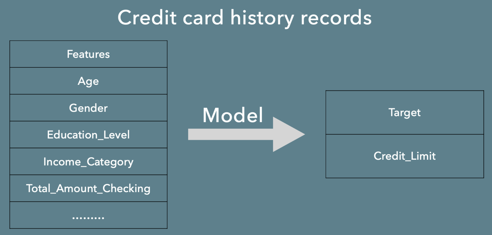
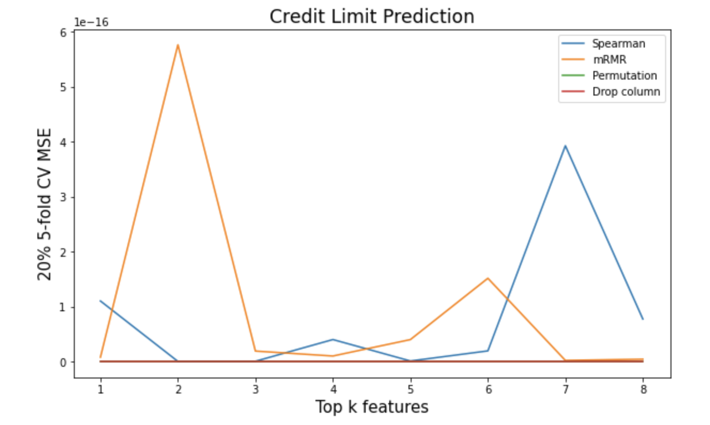

# CreditsPrediction
*Final project of Machine Learning Lab, USF MSDS program*

# Description

The dataset is from https://www.kaggle.com/sakshigoyal7/credit-card-customersand.

This project fits a credit limit prediction model using customers' information to predict credit limit of future customers.

# Model

- Regularized linear regression models
- Tree-based models

# Feature Importance Analysis

- Spearman correlation
- PCA
- mRMR
- Permutation importance
- Drop column importance
- Comparison

# Result

R2 = 0.97

Here is the link of notebook in Colab: https://colab.research.google.com/drive/1rsiGu_aHe_AbQD3gFFHtZMWwRM8bcQuC#scrollTo=6e5FWlAZLe9-, which is also presented in notebook file in this repo.
